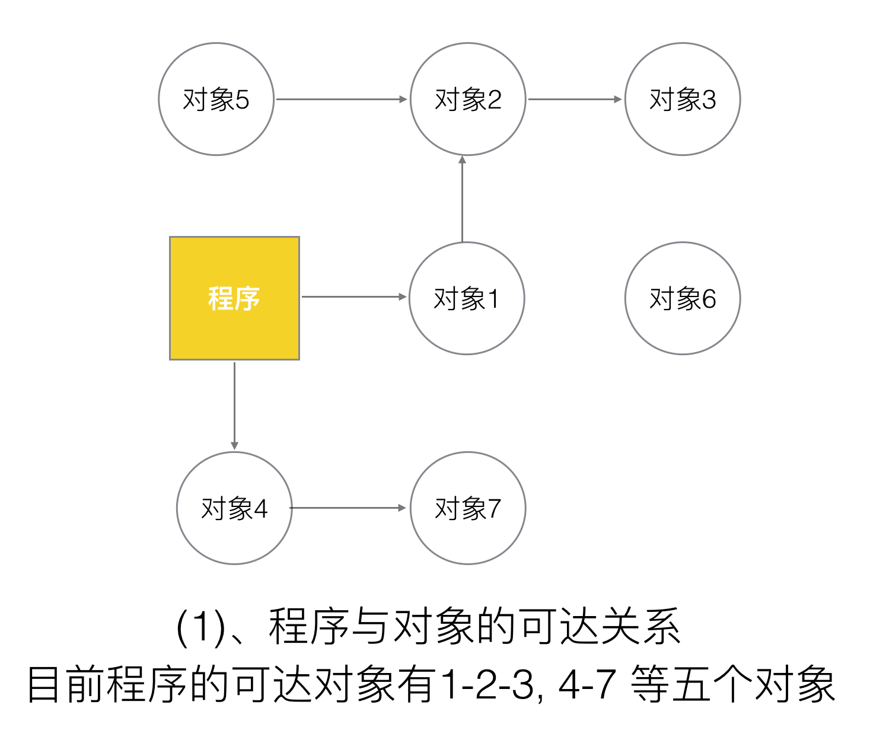
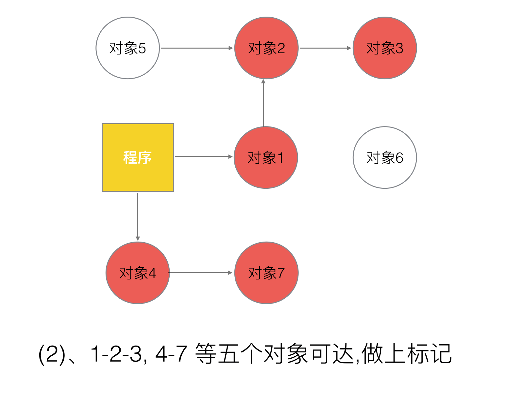

# GC 机制

[参考地鼠文档](https://www.topgoer.cn/docs/golangxiuyang/golangxiuyang-1cmee076rjgk7#anh6dl)

### 1. Go V1.3之前的标记-清除(mark and sweep)算法

- 标记(Mark phase)
- 清除(Sweep phase)

#### 1.1 STW(stop the word)基本流程
**mark and sweep算法在执行的时候，需要程序暂停**

> 1. 暂停程序业务逻辑, 找出不可达的对象，然后做上标记。第二步，回收标记好的对象



> 2. 开始标记，程序找出它所有可达的对象，并做上标记



> 3. 标记完了之后，然后开始清除未标记的对象


> 4. 停止暂停，让程序继续跑。然后循环重复这个过程，直到process程序生命周期结束


#### 1.2 标记-清扫(mark and sweep)的缺点
- STW，stop the world；让程序暂停，程序出现卡顿 (重要问题)
- 标记需要扫描整个heap
- 清除数据会产生heap碎片

### 2. Go V1.5的三色并发标记法
**三色标记法 实际上就是通过三个阶段的标记来确定清楚的对象都有哪些**

#### 2.1 三色标记法的基本流程
> 1. 新创建的对象,默认的颜色都是标记为“白色”


> 2. 每次GC回收开始, 然后从根节点开始遍历所有对象，把遍历到的对象从白色集合放入“灰色”集合


> 3. 遍历灰色集合，将灰色对象引用的对象从白色集合放入灰色集合，之后将此灰色对象放入黑色集合


> 4. 复第三步, 直到灰色中无任何对象.


> 5.  回收所有的白色标记表的对象. 也就是回收垃圾


#### 2.2 如果没有STW(stop the word)三色标记存在的问题？


```text
可以看出，有两个问题, 在三色标记法中,是不希望被发生的

条件1: 一个白色对象被黑色对象引用(白色被挂在黑色下)
条件2: 灰色对象与它之间的可达关系的白色对象遭到破坏(灰色同时丢了该白色)

当以上两个条件同时满足时, 就会出现对象丢失现象
如果上述中的白色对象3, 如果他还有很多下游对象的话, 也会一并都清理掉
```
> 为了防止这种现象的发生，最简单的方式就是STW，直接禁止掉其他用户程序对对象引用关系的干扰，但是**STW的过程有明显的资源浪费，对所有的用户程序都有很大影响**，如何能在保证对象不丢失的情况下合理的尽可能的提高GC效率，减少STW时间呢？

### 3. 屏障机制

#### 3.1 “强-弱” 三色不变式
##### 3.1.1 强三色不变式
> 黑色对象不会指向白色对象，只能指向灰色或黑色对象


##### 3.1.2 弱三色不变式
> 黑色对象可以指向白色对象，但此白色对象链路的上游中必须有一个灰色对象


#### 3.2 插入写屏障
> **具体操作:** 在A对象引用B对象的时候，B对象被标记为灰色。(将B挂在A下游，B必须被标记为灰色)
>
> **满足:** 强三色不变式. (不存在黑色对象引用白色对象的情况了， 因为白色会强制变成灰色)


#### 3.3 删除写屏障
> **具体操作:** 被删除的对象，如果自身为灰色或者白色，那么被标记为灰色
> 
> **满足:** 弱三色不变式. (保护灰色对象到白色对象的路径不会断)


#### 3.4 Go V1.8 混合写屏障机制
```text
插入写屏障和删除写屏障的短板：

    插入写屏障：结束时需要STW来重新扫描栈，标记栈上引用的白色对象的存活；

    删除写屏障：回收精度低，GC开始时STW扫描堆栈来记录初始快照，这个过程会保护开始时刻的所有存活对象。

Go V1.8版本引入了混合写屏障机制（hybrid write barrier），避免了对栈re-scan的过程，极大的减少了STW的时间。结合了两者的优点。
```
> 混合写屏障规则
```text
具体操作:

1、GC开始将栈上的对象全部扫描并标记为黑色(之后不再进行第二次重复扫描，无需STW)，

2、GC期间，任何在栈上创建的新对象，均为黑色。

3、被删除的对象标记为灰色。

4、被添加的对象标记为灰色。

满足: 变形的弱三色不变式.
```
**合写屏障是Gc的一种屏障机制，所以只是当程序执行GC的时候，才会触发这种机制**

> GC开始：扫描栈区，将可达对象全部标记为黑


> 场景一： 对象被一个堆对象删除引用，成为栈对象的下游
```go
//前提：堆对象4->对象7 = 对象7；  //对象7 被 对象4引用
栈对象1->对象7 = 堆对象7；  //将堆对象7 挂在 栈对象1 下游
堆对象4->对象7 = null；    //对象4 删除引用 对象7
```


> 对象被一个栈对象删除引用，成为另一个栈对象的下游

```go
new 栈对象9；
对象8->对象3 = 对象3；      //将栈对象3 挂在 栈对象9 下游
对象2->对象3 = null；      //对象2 删除引用 对象3
```


> 对象被一个堆对象删除引用，成为另一个堆对象的下游

```go
堆对象10->对象7 = 堆对象7；       //将堆对象7 挂在 堆对象10 下游
堆对象4->对象7 = null；         //对象4 删除引用 对象7
```


> 对象从一个栈对象删除引用，成为另一个堆对象的下游

```go
堆对象10->对象7 = 堆对象7；       //将堆对象7 挂在 堆对象10 下游
堆对象4->对象7 = null；         //对象4 删除引用 对象7
```


> olang中的混合写屏障满足弱三色不变式，结合了删除写屏障和插入写屏障的优点，只需要在开始时并发扫描各个goroutine的栈，使其变黑并一直保持，这个过程不需要STW，而标记结束后，因为栈在扫描后始终是黑色的，也无需再进行re-scan操作了，减少了STW的时间

#### 3.5 对比总结 
- GoV1.3- 普通标记清除法，整体过程需要启动STW，效率极低。

- GoV1.5- 三色标记法， 堆空间启动写屏障，栈空间不启动，全部扫描之后，需要重新扫描一次栈(需要STW)，效率普通

- GoV1.8-三色标记法，混合写屏障机制， 栈空间不启动，堆空间启动。整个过程几乎不需要STW，效率较高