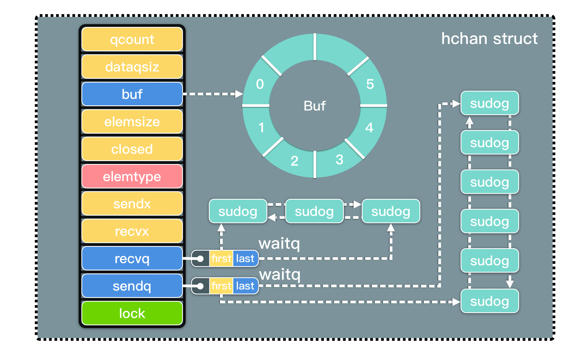
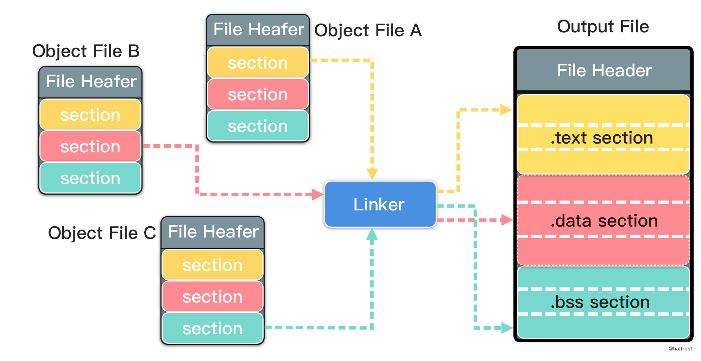

# Golang 数据类型

### 1. golang 中的引用类型
> 引用类型是 map,slice,channel

#### 1.1 Slice
```go
// 1. slice 赋值 
/*
切片 slice 的赋值操作是改变了 slice 内部结构的值. 所以赋值后改变的是指针 array 指向的地址、len 和 cap 值. 赋值操作的左、右俩个切片的 array 指向的是同一个数组，所以它们的数组中元素的值也会一起发生改变
*/

// 2. slic 拷贝
/*
对于切片直接用 = 拷贝，实际上是浅拷贝，只是改变了指针的指向，并没有改变数组中元素的值. 对于深度拷贝的需求，可以借助 copy 内置函数完成
*/

// 3. 函数传递
/*
golang 函数的参数传递都是值传递，而 map、channel、slice 都是引用类型，会传递指针值. 但是，切片的结构及扩容机制特殊
在切片进行复制时，会将切片的值（指针、cap、len)复制了一份. 在函数内部可以改变原切片的值.
*/

// 4. 切片 slice 的扩容
/*
1) 首先判断，如果新申请容量（cap）大于2倍的旧容量（old.cap），最终容量（newcap）就是新申请的容量（cap）
2) 否则判断，如果旧切片的长度小于1024，则最终容量(newcap)就是旧容量(old.cap)的两倍，即（newcap=2cap）
3) 否则判断，如果旧切片长度大于等于1024，则最终容量（newcap）从旧容量（old.cap）开始循环增加原来的 1/4，即（newcap=old.cap,for {newcap += newcap/4}）直到最终容量（newcap）大于等于新申请的容量(cap)，即（newcap >= cap）
4) 如果最终容量（cap）计算值溢出，则最终容量（cap）就是新申请容量（cap）
*/
type slice struct {
    array unsafe.Pointer // 指向数组的指针
    len   int            // 切片中元素的数量
    cap   int            // array 数组的总容量
}
```

#### 1.2 Map
```go
// map 的底层本质上是实现散列表，它解决碰撞的方式是拉链法. map 在进行扩容时不会立即替换原内存，而是慢慢的通过 GC 方式释放

// map的底层结构
type hmap struct {
  count     int 
  flags     uint8
  B         uint8 
  noverflow uint16 
  hash0     uint32 
  buckets    unsafe.Pointer
  oldbuckets unsafe.Pointer 
  nevacuate  uintptr        
  extra *mapextra
}

/*
buckets、oldbuckets 是指向存储键值的内存地址, 其中 oldbuckets 用于在扩容时候，指向旧的 bucket 地址，再下次访问时不断的将 oldbuckets 值转移到 buckets 中. oldbuckets 并不直接释放内存，而是通过不引用，交由 gc 释放内存
*/

// hmap 散列表和bucket
/*
1. hmap 中核心的结构是 buckets，它是 bucket 数组，其中每个 bucket 是一个链表. 这个结构其实就是散列表的实现，通过拉链法消除 hash 冲突. 使得散列表能够存储更多的元素，同时避免过大的连续内存申请.

2. 在哈希表结构中有一个加载因子(即 loadFactor), 它一般是散列包含的元素数除以位置总数. 加载因子越高，冲突产生的概率越高. 
当达到一定阈值时，就该为哈希表进行扩容了，否则查询效率将会很低.
当 golang map 的加载因子大于阈值时，len(map) / 2 ^ B > 6.5 时 ，就会对 map 对象进行扩容. 
扩容不会立刻释放掉原来的 bucket 内存，而是由 oldbucket 指向，并产生新的 buckets 数组并由指针 buckets 指向. 
在再次访问原数据时，再依次将老的 bucket 移到新的 buckets 数组中. 同时解除对老的 bucket 的引用，GC 会统一释放掉这些内存

3. 哈希函数通过 key 值计算哈希，快速映射到数据的地址. golang 的 map 进行哈希计算后，将结果分为高位值和低位值，其中低位值用于定位 buckets 数组中的具体 bucket，而高位值用于定位这个 bucket 链表中具体的 key 
*/
```

#### 1.3 Channel
```go
// chan 结构为hchan，其中主要包括 buf、sendx、recvx、sendq、recvq...

type hchan struct {
	qcount   uint           // 队列中所有数据总数
	dataqsiz uint           // 环形队列的 size
	buf      unsafe.Pointer // 指向 dataqsiz 长度的数组
	elemsize uint16         // 元素大小
	closed   uint32
	elemtype *_type         // 元素类型
	sendx    uint           // 已发送的元素在环形队列中的位置
	recvx    uint           // 已接收的元素在环形队列中的位置
	recvq    waitq          // 接收者的等待队列
	sendq    waitq          // 发送者的等待队列

	lock mutex
}

/*
buf: 有缓冲通道用于存储缓存数据的空间, 它是一个循环链表.
sendx 和 recvx: 用于记录循环链表 buf 中的发送或者接受的 index.
sendq 和 recvq: 是俩个双向队列，分别是发送、接受的 goroutine 抽象出来的 sudog 结构体的队列.
lock: 保护 hchan 中的所有字段，以及此通道上被阻塞的 sudogs 中的多个字段。持有 lock 的时候，禁止更改另一个 G 的状态（特别是不要使 G 状态变成ready），因为这会因为堆栈 shrinking 而发生死锁
*/
```



> channel 最核心的数据结构是 sudog。sudog 代表了一个在等待队列中的 g。sudog 是 Go 中非常重要的数据结构，因为 g 与同步对象关系是多对多的。一个 g 可以出现在许多等待队列上，因此一个 g 可能有很多sudog。并且多个 g 可能正在等待同一个同步对象，因此一个对象可能有许多 sudog。sudog 是从特殊池中分配出来的。使用 acquireSudog 和 releaseSudog 分配和释放它们
```go
type sudog struct {
	g *g

	next *sudog
	prev *sudog
	elem unsafe.Pointer // 指向数据 (可能指向栈)

	acquiretime int64
	releasetime int64
	ticket      uint32

	isSelect bool
	success bool

	parent   *sudog     // semaRoot 二叉树
	waitlink *sudog     // g.waiting 列表或者 semaRoot
	waittail *sudog     // semaRoot
	c        *hchan     // channel
}

```
> sudog 中所有字段都受 hchan.lock 保护。acquiretime、releasetime、ticket 这三个字段永远不会被同时访问。对 channel 来说，waitlink 只由 g 使用。对 semaphores 来说，只有在持有 semaRoot 锁的时候才能访问这三个字段。isSelect 表示 g 是否被选择，g.selectDone 必须进行 CAS 才能在被唤醒的竞争中胜出。success 表示 channel c 上的通信是否成功。如果 goroutine 在 channel c 上传了一个值而被唤醒，则为 true；如果因为 c 关闭而被唤醒，则为 false

```go
ch1 := make(chan int)   // 无缓冲通道
ch2 := make(chan int, 3)   // 有缓冲通道
// 本质上是创建了一个 hchan 结构体，返回指针 ch1 . 
// chan 在 go 语言中是引用类型, 在参数传递过程是复制的是这个指针值


// send 和 recv
/*
首先会使用 lock 锁住 hchan. 然后以 sendx 或 recvx 序号，在循环链表 buf 指定的位置上找到数据，将数据 copy 到 goroutine 或者时从 goroutine copy 的 buf 上. 然后释放锁
*/

// 关闭chan
close(ch)  // 编译器会将其转换为 runtime.closechan() 方法

/*
Channel都有哪些特性？

给一个 nil channel 发送数据，造成永远阻塞

从一个 nil channel 接收数据，造成永远阻塞

给一个已经关闭的 channel 发送数据，引起 panic

从一个已经关闭的 channel 接收数据，如果缓冲区中为空，则返回一个零值

无缓冲的channel是同步的，而有缓冲的channel是非同步的

总结： "空读写阻塞，写关闭异常，读关闭空零"
*/
```


### 2. interface 的原理
> interface 可以用在任何使用变量的地方。可以作为结构体内的字段，可以作为函数的形参和返回值，可以作为其他 interface 定义的内嵌字段

**非空 interface 数据结构**
```go
// 非空的 interface 初始化的底层数据结构是 iface

// tab 中存放的是类型、方法等信息
// data 指针指向的 iface 绑定对象的原始数据的副本，其中tab 是 itab 类型的指针
type iface struct {
	tab  *itab
	data unsafe.Pointer
}

/*
inner 存的是 interface 自己的静态类型
_type 存的是 interface 对应具体对象的类型
_type 是这个变量对应的类型，data 是这个变量的值
fun 是一个函数指针，它指向的是具体类型的函数方法,这个指针对应内存地址的后面依次存储了多个方法，利用指针偏移便可以找到它们
*/
type itab struct {
	inter *interfacetype
	_type *_type
	hash  uint32 
	_     [4]byte
	fun   [1]uintptr
}

type _type struct {
	size       uintptr // 类型占用内存大小
	ptrdata    uintptr // 包含所有指针的内存前缀大小
	hash       uint32  // 类型 hash
	tflag      tflag   // 标记位，主要用于反射
	align      uint8   // 对齐字节信息
	fieldAlign uint8   // 当前结构字段的对齐字节数
	kind       uint8   // 基础类型枚举值
	equal func(unsafe.Pointer, unsafe.Pointer) bool // 比较两个形参对应对象的类型是否相等
	gcdata    *byte    // GC 类型的数据
	str       nameOff  // 类型名称字符串在二进制文件段中的偏移量
	ptrToThis typeOff  // 类型元信息指针在二进制文件段中的偏移量
}

// str 和 ptrToThis，对应的类型是 nameoff 和 typeOff。这两个字段的值是在链接器段合并和符号重定向的时候赋值的
```

```go
/*
链接器将各个 .o 文件中的段合并到输出文件，会进行段合并，有的放入 .text 段，有的放入 .data 段，有的放入 .bss 段。name 和 type 针对最终输出文件所在段内的偏移量 offset 是由 resolveNameOff 和 resolveTypeOff 函数计算出来的，然后链接器把结果保存在 str 和 ptrToThis 中
*/
func resolveNameOff(ptrInModule unsafe.Pointer, off nameOff) name {}  

func resolveTypeOff(ptrInModule unsafe.Pointer, off typeOff) *_type {}
```

> _type 是所有类型原始信息的元信息

```go
// 例如 arraytype 和 chantype 中保存类型的元信息就是靠 _type
type arraytype struct {
	typ   _type
	elem  *_type
	slice *_type
	len   uintptr
}

type chantype struct {
	typ  _type
	elem *_type
	dir  uintptr
}

// 接口类型定义也依赖与_type
type imethod struct {
	name nameOff
	ityp typeOff
}

type interfacetype struct {
	typ     _type     // 类型元信息
	pkgpath name      // 包路径和描述信息等等
	// 函数方法是以包为单位隔离的,所以mhdr 存的是各个 interface 函数方法在段内的偏移值 offset，知道偏移值以后才方便调用
  mhdr    []imethod 
}

```

**空 interface 数据结构**
```go
// 空的 inferface{} 是没有方法集的接口,所以不需要 itab 数据结构,它只需要存类型和类型对应的值

// 从以下数据结构可以看出，只有当 2 个字段都为 nil，空接口才为 nil
type eface struct {
	_type *_type
	data  unsafe.Pointer
}
```
