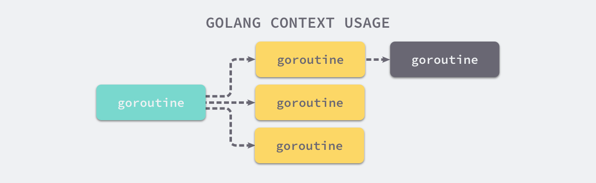

# Context

[Go语言设计与实现](https://draveness.me/golang/docs/part3-runtime/ch06-concurrency/golang-context/)

> 上下文 context.Context Go 语言中用来设置截止日期、同步信号，传递请求相关值的结构体
> context.Context 是 Go 语言在 1.7 版本中引入标准库的接口

```golang
/*
Deadline — 返回 context.Context 被取消的时间，也就是完成工作的截止日期；
Done — 返回一个 Channel，这个 Channel 会在当前工作完成或者上下文被取消后关闭，多次调用 Done 方法会返回同一个 Channel；
Err — 返回 context.Context 结束的原因，它只会在 Done 方法对应的 Channel 关闭时返回非空的值；
    1) 如果 context.Context 被取消，会返回 Canceled 错误；
    2) 如果 context.Context 超时，会返回 DeadlineExceeded 错误；
Value — 从 context.Context 中获取键对应的值，对于同一个上下文来说，多次调用 Value 并传入相同的 Key 会返回相同的结果，该方法可以用来传递请求特定的数据
*/

type Context interface {
	Deadline() (deadline time.Time, ok bool)
	Done() <-chan struct{}
	Err() error
	Value(key interface{}) interface{}
}

// context 包中提供的 context.Background、context.TODO、context.WithDeadline 和 context.WithValue 函数会返回实现该接口的私有结构体
```

### 1. 设计原理
> context.Context 的最大作用是Goroutine 构成的树形结构中对信号进行同步以减少计算资源的浪费。Go 服务的每一个请求都是通过单独的 Goroutine 处理的，HTTP/RPC 请求的处理器会启动新的 Goroutine 访问数据库和其他服务
> 
> 当创建多个 Goroutine 来处理一次请求时，context.Context 的作用是在不同 Goroutine 之间同步请求特定数据、取消信号以及处理请求的截止日期



#### 1.1 Context 与 Goroutine 树
> 每一个 context.Context 都会从最顶层的 Goroutine 一层一层传递到最下层。context.Context 可以在上层 Goroutine 执行出现错误时，将信号及时同步给下层


#### 1.2  不使用 Context 同步信号

> 当最上层的 Goroutine 因为某些原因执行失败时，下层的 Goroutine 由于没有接收到这个信号所以会继续工作；但是当我们正确地使用 context.Context 时，就可以在下层及时停掉无用的工作以减少额外资源的消耗


#### 1.3 使用 Context 同步信号
> context.Context 同步过程
```golang
func main() {
	ctx, cancel := context.WithTimeout(context.Background(), 1*time.Second)
	defer cancel()

	go handle(ctx, 500*time.Millisecond)
	select {
	case <-ctx.Done():
		fmt.Println("main", ctx.Err())
	}
}

func handle(ctx context.Context, duration time.Duration) {
	select {
	case <-ctx.Done():
		fmt.Println("handle", ctx.Err())
	case <-time.After(duration):
		fmt.Println("process request with", duration)
	}
}


// 因为过期时间大于处理时间，所以我们有足够的时间处理该请求，运行上述代码会打印出下面的内容
/*
$ go run context.go
process request with 500ms
main context deadline exceeded
*/

/*
handle 函数没有进入超时的 select 分支，但是 main 函数的 select 却会等待 context.Context 超时并打印出 main context deadline exceede

将处理请求时间增加至大于1000ms，整个程序都会因为上下文的过期而被中止，：

$ go run context.go
main context deadline exceeded
handle context deadline exceeded

context.Context 的使用方法和设计原理 — 多个 Goroutine 同时订阅 ctx.Done() 管道中的消息，一旦接收到取消信号就立刻停止当前正在执行的工作
*/
```

### 2. context 常用方法

#### 2.1 context.Background() & context.TODO()
> context 包中最常用的方法还是 context.Background、context.TODO，这两个方法都会返回预先初始化好的私有变量 background 和 todo

```go
func Background() Context {
	return background
}

func TODO() Context {
	return todo
}
```
> 这两个私有变量都是通过 new(emptyCtx) 语句初始化的，它们是指向私有结构体 context.emptyCtx 的指针,context.emptyCtx 通过空方法实现了 context.Context 接口中的所有方法，它没有任何功能,所以它是最快的
```go
type emptyCtx int

func (*emptyCtx) Deadline() (deadline time.Time, ok bool) {
	return
}

func (*emptyCtx) Done() <-chan struct{} {
	return nil
}

func (*emptyCtx) Err() error {
	return nil
}

func (*emptyCtx) Value(key any) any {
	return nil
}
```

- context.Background 是上下文的默认值，所有其他的上下文都应该从它衍生出来；
- context.TODO 应该仅在不确定应该使用哪种上下文时使用；

#### 2.2 context.WithCancel
> context.WithCancel 函数能够从 context.Context 中衍生出一个新的子上下文并返回用于取消该上下文的函数,一旦我们执行返回的取消函数，当前上下文以及它的子上下文都会被取消，所有的 Goroutine 都会同步收到这一取消信号


```go
// context.newCancelCtx 将传入的上下文包装成私有结构体 context.cancelCtx
func WithCancel(parent Context) (ctx Context, cancel CancelFunc) {
	c := newCancelCtx(parent)
	propagateCancel(parent, &c)
	return &c, func() { c.cancel(true, Canceled) }
}
```

#### 2.3 context.WithValue 
```go
func WithValue(parent Context, key, val interface{}) Context {
	if key == nil {
		panic("nil key")
	}
	if !reflectlite.TypeOf(key).Comparable() {
		panic("key is not comparable")
	}
	return &valueCtx{parent, key, val}
}
```
> context.valueCtx 结构体会将除了 Value 之外的 Err、Deadline 等方法代理到父上下文中，它只会响应 context.valueCtx.Value 方法

```go
type valueCtx struct {
	Context
	key, val interface{}
}

func (c *valueCtx) Value(key interface{}) interface{} {
	if c.key == key {
		return c.val
	}
	return c.Context.Value(key)
}
```

> 如果 context.valueCtx 中存储的键值对与 context.valueCtx.Value 方法中传入的参数不匹配，就会从父上下文中查找该键对应的值直到某个父上下文中返回 nil 或者查找到对应的值