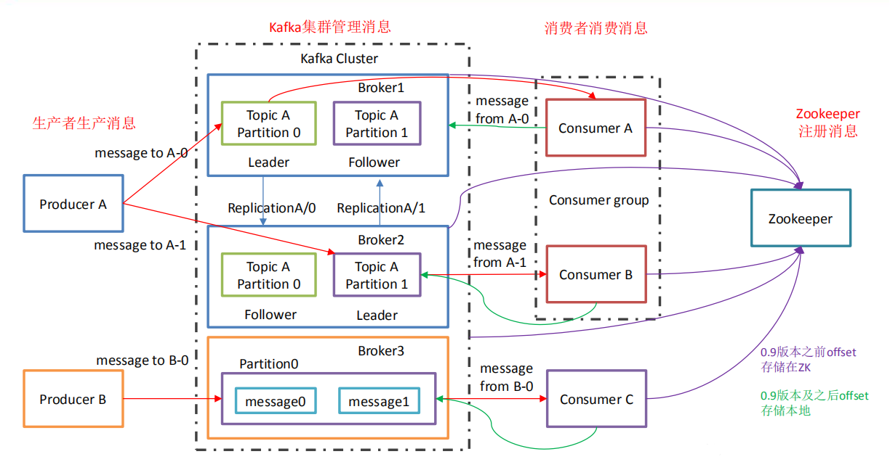

### Kafka 的基本简介

#### 1. 什么是 Kafka？

>Kafka是最初由Linkedin公司开发，是一个分布式、支持分区的（partition）、多副本的
（replica），基于zookeeper协调的分布式消息系统，它的最大的特性就是可以实时的处理
大量数据以满足各种需求场景：比如基于hadoop的批处理系统、低延迟的实时系统、
Storm/Spark流式处理引擎，web/nginx日志、访问日志，消息服务等等，用scala语言编
写，Linkedin于 2010 年贡献给了Apache基金会并成为顶级开源项目。

> Zookeeper 作为一个分布式的服务框架，主要用来解决分布式集群中应用系统的一致性问题。ZooKeeper提供的服务包括：分布式消息同步和协调机制、
>
> 服务器节点动态上下线、统一配置管理、负载均衡、集群管理等

>kafka是一个分布式的，分区的消息(官方称之为commit log)服务。它提供一个消息系统应该
具备的功能，但是确有着独特的设计。可以这样来说，Kafka借鉴了JMS规范的思想，但是确
并 `没有完全遵循JMS规范。`

**kafka 架构流程图**




| 名称 | 解释 |
|:--: | :--: |
| Broker | 消息中间件处理节点，⼀个Kafka节点就是⼀个broker，⼀个或者多个Broker可以组成⼀个Kafka集群 |
| Topic | Kafka根据topic对消息进⾏归类，发布到Kafka集群的每条消息都需要指定⼀个topic |
| Producer | 消息⽣产者，向Broker发送消息的客户端 |
| Consumer | 消息消费者，从Broker读取消息的客户端 |
| ConsumerGroup | 每个Consumer属于⼀个特定的Consumer Group，⼀条消息可以被多个不同的Consumer Group消费，但是⼀个Consumer Group中只能有⼀个Consumer能够消费该消息 |
| Partition| 物理上的概念，⼀个topic可以分为多个partition，每个partition内部消息是有序的 | 
| Replica | 副本，本质就是一个只能追加写消息的提交日志。Kafka 副本机制的定义，同一个分区下的所有副本保存有相同的消息序列，这些副本分散保存在不同的 Broker 上，从而能够对抗部分 Broker 宕机带来的数据不可用 |
| leader | 每个分区多个副本的主，也是处理生产者消费者消息的对象  |
| follower | 每个分区多个副本的从，实时从leader中同步数据，leader出现故障时，某个follower会成为新的leader，担任leader的任务 |


#### 2. 基于docker-compse启动kafak

**镜像拉取**
```sh
# 1. 拉取镜像
[root@iZ2ze58f53sxjm9z7mgn5xZ ~]# docker pull wurstmeister/zookeeper

[root@iZ2ze58f53sxjm9z7mgn5xZ ~]# docker pull wurstmeister/kafka

```
**docker-compose-kafka.yml 编写**
```sh
# 安装docker-compose
># sudo curl -L https://get.daocloud.io/docker/compose/releases/download/1.25.1/docker-compose-`uname -s`-`uname -m` -o /usr/local/bin/docker-compose

># chmod +x /usr/local/bin/docker-compose
```

```yml
# 2. 编写docker-compose
# 搭建kafka集群
version: "3.7"
services:
  zookeeper:
    container_name: zk
    image: wurstmeister/zookeeper
    restart: always
    volumes:
      - ./data:/data
    ports:
      - 2181:2181

  kafka1:
    container_name: kafka1
    image: wurstmeister/kafka
    restart: always
    ports:
      - 9092:9092
    environment:
      KAFKA_BROKER_ID: 1
      KAFKA_ADVERTISED_LISTENERS: PLAINTEXT://8.141.175.100:9092
      KAFKA_ADVERTISED_HOST_NAME: 8.141.175.100          # 如果设置，则就作为broker 的hostname发往producer、consumers以及其他brokers
#      KAFKA_CREATE_TOPICS: "myTopic:3" #kafka启动后初始化一个有3个partition(分区)0个副本名叫myTopic的topic
      KAFKA_ZOOKEEPER_CONNECT: zk:2181          # zookeeper集群连接地址
      KAFKA_ADVERTISED_PORT: 9092            # 此端口将给与producers、consumers、以及其他brokers，它会在建立连接时用到
      KAFKA_LISTENERS: PLAINTEXT://0.0.0.0:9092
      KAFKA_HEAP_OPTS: "-Xmx256M -Xms128M"
      ALLOW_PLAINTEXT_LISTENER: 'true'
    volumes:
      - ./kafka1-logs:/kafka
    depends_on:
      - zookeeper
  kafka2:
    container_name: kafka2
    image: wurstmeister/kafka
    restart: always
    ports:
      - 9093:9093
    environment:
      KAFKA_BROKER_ID: 2
      KAFKA_ADVERTISED_LISTENERS: PLAINTEXT://8.141.175.100:9093
      KAFKA_ADVERTISED_HOST_NAME: 8.141.175.100
      # KAFKA_CREATE_TOPICS: "myTopic:3" #kafka启动后初始化一个有3个partition(分区)0个副本名叫myTopic的topic
      KAFKA_ZOOKEEPER_CONNECT: zk:2181
      KAFKA_ADVERTISED_PORT: 9093
      KAFKA_LISTENERS: PLAINTEXT://0.0.0.0:9093
      KAFKA_HEAP_OPTS: "-Xmx256M -Xms128M"
      ALLOW_PLAINTEXT_LISTENER: 'true'
    volumes:
      - ./kafka2-logs:/kafka
    depends_on:
      - zookeeper
  kafka3:
    container_name: kafka3
    image: wurstmeister/kafka
    restart: always
    ports:
      - 9094:9094
    environment:
      KAFKA_BROKER_ID: 3
      KAFKA_ADVERTISED_LISTENERS: PLAINTEXT://8.141.175.100:9094
      KAFKA_ADVERTISED_HOST_NAME: 8.141.175.100
      # KAFKA_CREATE_TOPICS: "myTopic:3" #kafka启动后初始化一个有3个partition(分区)0个副本名叫myTopic的topic
      KAFKA_ZOOKEEPER_CONNECT: zk:2181
      KAFKA_ADVERTISED_PORT: 9094
      KAFKA_LISTENERS: PLAINTEXT://0.0.0.0:9094
      KAFKA_HEAP_OPTS: "-Xmx256M -Xms128M"
      ALLOW_PLAINTEXT_LISTENER: 'true'
    volumes:
      - ./kafka3-logs:/kafka
    depends_on:
      - zookeeper

# 启动：
docker-compose -f $docker-compose-file-name up -d
```

**命令行详细操作**
```text
# 以下参数相互等价，启动容器时指定或者修改server.properties 配置文件
# KAFKA_BROKER_ID=1                       kafka.borker.id=1                                   kafka在集群中的唯一标识
# KAFKA_ZOOKEEPER_CONNECT                 zookeeper.connect=zookeeper:2181                    监听zookeeper的地址 
# KAFKA_ADVERTISED_LISTENERS              advertised.listeners=PLAINTEXT://localhost:9092     kafka服务器的地址
# KAFKA_DELETE_TOPIC_ENABLE               delete.topic.enable                                 是否可以删除主题

# 3. 进入容器，启动kafka
[root@iZ2ze58f53sxjm9z7mgn5xZ ~]# docker exec -it kafka bash
4564
root@254f27b7c46d:# cd /opt/kafka_2.18/bin


# 4. 创建一个topic
root@254f27b7c46d:/opt/kafka_2.13-2.8.1# ./bin/kafka-topics.sh --create --zookeeper zk:2181 --replication-factor 1 --partitions 1 --topic myTopic
WARNING: Due to limitations in metric names, topics with a period ('.') or underscore ('_') could collide. To avoid issues it is best to use either, but not both.
Created topic myTopic.


# 5. 运行生产者
root@254f27b7c46d:/opt/kafka_2.13-2.8.1# ./bin/kafka-console-producer.sh --broker-list localhost:9092 --topic myTopic
> hello

# 6. 运行消费者
root@f18981b67d0c:/opt/kafka_2.13-2.8.1/bin# ./bin/kafka-console-consumer.sh --bootstrap-server localhost:9092 --from-beginning --topic myTopic
hello

#-----------------------------------------------------------
# 生产者发送消息，消费者可以看到
# 7. 查看所有topic
root@f18981b67d0c:/opt/kafka_2.13-2.8.1/bin# ./kafka-topics.sh --zookeeper zk:2181 --list
myTopic

# 8. 删除主题,需要先更改server.properties 中
root@f18981b67d0c:/opt/kafka_2.13-2.8.1/bin# kafka-topics.sh  --delete --topic myTopic --zookeeper zk:2181


# 如果停止服务提示没有ps指令,使用以下命令安装
# apt-get update
# apt-get  install  procps
```


#### 3. golang 操作kafka细节

##### 3.1 golang 客户端demo见code目录


##### 3.2 zookeeper的作用
> kafak 集群中有一个broker会被选举为controller，负责管理集群broker的上下线，所有topic的分区副本和leader选举等任务，controller的管理工作依赖于zookeeper。


##### 3.3 在同步发消息的场景下：生产者发送消息到broker上后，ack的3 种不同的选择
* 1) acks=0： 表示producer不需要等待任何broker确认收到消息的回复，就可以继续发送下一条消息。性能最高，但是最容易丢消息。
* 2) acks=1： 至少要等待leader已经成功将数据写入本地log，但是不需要等待所有follower是否成功写入。就可以继续发送下一条消息。这种情况下，如果follower没有成功备份数据，而此时leader又挂掉，则消息会丢失。
* 3) acks=-1或all： 需要等待 min.insync.replicas(默认为 1 ，推荐配置大于等于2) 这个参数配置的副本个数都成功写入日志，这种策略会保证只要有一个备份存活就不会丢失数据。这是最强的数据保证。一般除非是金融级别，或跟钱打交道的场景才会使用这种配置。

```go
const (
	// NoResponse doesn't send any response, the TCP ACK is all you get.
	NoResponse RequiredAcks = 0
	// WaitForLocal waits for only the local commit to succeed before responding.
	WaitForLocal RequiredAcks = 1
	// WaitForAll waits for all in-sync replicas to commit before responding.
	// The minimum number of in-sync replicas is configured on the broker via
	// the `min.insync.replicas` configuration key.
	WaitForAll RequiredAcks = -1
)

config.Producer.RequiredAcks = sarama.WaitForAll

```

##### 3.4 自动提交offset
```go
// AutoCommit specifies configuration for commit messages automatically.
AutoCommit struct {
  // Whether or not to auto-commit updated offsets back to the broker.
  // (default enabled).
  Enable bool

  // How frequently to commit updated offsets. Ineffective unless
  // auto-commit is enabled (default 1s)
  Interval time.Duration
}

	config.Consumer.Offsets.AutoCommit.Enable = true
	config.Consumer.Offsets.AutoCommit.Interval = time.Duration(1000)

/*
消费者pull到消息后默认情况下，会自动向broker的_consumer_offsets主题提交当前主题-分区消费的偏移量。

自动提交会丢消息： 因为如果消费者还没消费完pull下来的消息就自动提交了偏移量，那么此 时消费者挂了，于是下一个消费者会从已提交的offset的下一个位置开始消费消息。之前未被消费的消息就丢失掉了
*/
```

#### 4. Kafka集群Controller、Rebalance和HW

###### 1.Controller

* Kafka集群中的broker在zk中创建临时序号节点，序号最小的节点（最先创建的节点）将作为集群的controller，负责管理整个集群中的所有分区和副本的状态：
    * 当某个分区的leader副本出现故障时，由控制器负责为该分区选举新的leader副本。
    * 当检测到某个分区的ISR集合发生变化时，由控制器负责通知所有broker更新其元数据信息。
    * 当使用kafka-topics.sh脚本为某个topic增加分区数量时，同样还是由控制器负责让新分区被其他节点感知到。

###### 2.Rebalance机制

前提是：消费者没有指明分区消费。当消费组里消费者和分区的关系发生变化，那么就会触发rebalance机制。

这个机制会重新调整消费者消费哪个分区。

在触发rebalance机制之前，消费者消费哪个分区有三种策略：

* range：通过公示来计算某个消费者消费哪个分区
* 轮询：大家轮着消费
* sticky：在触发了rebalance后，在消费者消费的原分区不变的基础上进行调整。

###### 3.HW和LEO

>HW俗称高水位，HighWatermark的缩写，取一个partition对应的ISR中最小的LEO(log-end-offset)作为HW，consumer最多只能消费到HW所在的位置。另外每个replica都有HW,leader和follower各自负责更新自己的HW的状态。对于leader新写入的消息，consumer不能立刻消费，leader会等待该消息被所有ISR中的replicas同步后更新HW，此时消息才能被consumer消费。这样就保证了如果leader所在的broker失效，该消息仍然可以从新选举的leader中获取。

##### 5. Kafka线上问题优化

###### 1.如何防止消息丢失

* 发送方： ack是 1 或者-1/all 可以防止消息丢失，如果要做到99.9999%，ack设成all，把min.insync.replicas配置成分区备份数
* 消费方：把自动提交改为手动提交。

###### 2.如何防止消息的重复消费

>一条消息被消费者消费多次。如果为了消息的不重复消费，而把生产端的重试机制关闭、消费端的手动提交改成自动提交，这样反而会出现消息丢失，那么可以直接在防止消息丢失的手段上再加上消费消息时的幂等性保证，就能解决消息的重复消费问题。

###### 幂等性如何保证：

* mysql 插入业务id作为主键，主键是唯一的，所以一次只能插入一条
* 使用redis或zk的分布式锁（主流的方案）

###### 3.如何做到顺序消费RocketMQ

* 发送方：在发送时将ack不能设置 0 ，关闭重试，使用同步发送，等到发送成功再发送下一条。确保消息是顺序发送的。
* 接收方：消息是发送到一个分区中，只能有一个消费组的消费者来接收消息。因此，kafka的顺序消费会牺牲掉性能。

###### 4.解决消息积压问题

>消息积压会导致很多问题，比如磁盘被打满、生产端发消息导致kafka性能过慢，就容易出现服务雪崩，就需要有相应的手段：

* 方案一：在一个消费者中启动多个线程，让多个线程同时消费。——提升一个消费者的消费能力（增加分区增加消费者）。
* 方案二：如果方案一还不够的话，这个时候可以启动多个消费者，多个消费者部署在不同的服务器上。其实多个消费者部署在同一服务器上也可以提高消费能力——充分利用服务器的cpu资源。
* 方案三：让一个消费者去把收到的消息往另外一个topic上发，另一个topic设置多个分区和多个消费者 ，进行具体的业务消费。

###### 5.延迟队列

延迟队列的应用场景：在订单创建成功后如果超过 30 分钟没有付款，则需要取消订单，此时可用延时队列来实现

* 创建多个topic，每个topic表示延时的间隔
    * topic_5s: 延时5s执行的队列
    * topic_1m: 延时 1 分钟执行的队列
    * topic_30m: 延时 30 分钟执行的队列

* 消息发送者发送消息到相应的topic，并带上消息的发送时间
* 消费者订阅相应的topic，消费时轮询消费整个topic中的消息
    * 如果消息的发送时间，和消费的当前时间超过预设的值，比如 30 分钟
    * 如果消息的发送时间，和消费的当前时间没有超过预设的值，则不消费当前的offset及之后的offset的所有消息都消费
    * 下次继续消费该offset处的消息，判断时间是否已满足预设值

###### 6. 生产者消息重复

> **启动kafka的幂等性**

个生产者producer都有一个唯一id，producer每发送一条数据都会带上一个sequence，当消息落盘，sequence就会递增1。只需判断当前消息的sequence是否大于当前最大sequence，大于就代表此条数据没有落盘过，可以正常消费；不大于就代表落盘过，这个时候重发的消息会被服务端拒掉从而避免消息重复。
