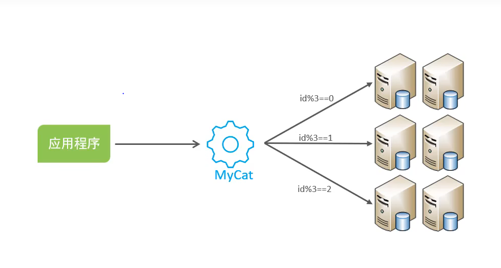

### mysql 中的分库分表

#### 1. 概述介绍


```text
1) 为什么要进行分库分表，单数据库存在什么性能问题？
    A) IO 瓶颈，热点数据太多，数据库缓存不足，产生大量磁盘IO，效率较低；请求数据太多，贷款不够，网络 IO 瓶颈.
    B) CPU 瓶颈，排序、分组、连接查询、聚合统计等sql语句会耗费大量的CPU资源，请求数量太大，CPU出现瓶颈，影响性能.


分库分表的中心思想都是将数据分散存储，使得单一数据库/表变小来缓解单一数据库可能造成的性能问题，从而达到提升数据库性能的目的.
```

**分库分表示意图**


**维度示意图**


```text
2) 分库分表的维度之垂直拆分:
    垂直分库：以表为依据，根据业务将不同的表拆分到不同的库中
    垂直分表：以字段为依据，根据字段属性将不同的字段拆分到不同的表中
    
垂直分库的特点:
    A) 每个库的表结构都不一样
    B) 每个库的数据也不一样
    C) 全量数据是所有库的并集

垂直分表的特点:
    A) 每个表结构一样
    B) 每个表数据也不一样，一般通过一列(主键/外键)相互关联
    C) 全量数据是所有表的并集

```

**垂直拆分示意图**


```text
3) 分库分表的维度之水平拆分
    水平分库：以字段为依据，根据一定的策略，将一个库的数据拆分到多个库中
    水平分表：以字段为依据，根据一定的策略，将一个表中的数据拆分到多个表中

水平分库的特点:
    A) 每个库的表结构都一样
    B) 每个库的数据都不一样
    C) 全量数据是所有库的并集

水平分表的特点:
    A) 每个表结构都一样
    B) 每个表数据都不一样
    C) 全量数据是所有表的并集
```

**水平拆分示意图**


```text
4) 分库分表实现技术
    A) shardingJDBC: 只支持java
    B) MyCat: 数据库分库分表中间件，不需要调整代码即可实现分库分表，支持多语言
```

**mycat访问示意图**



```text
MyCat详细介绍:
    mycat 是一个基于JAVA语言编写的开源的mysql数据库中间件，使用方式和mysql一样.

    app -> mycat -> mysql_server

```


change master to master_host='8.141.175.100',master_user='slave',master_password='123456',master_log_file='mysql-bin.000001',master_log_pos=156;

load data local infile '/root/mysql_test/sql_data/sql_file_1000w/tb_sku1.sql' into table my_test.tb_sku fields terminated by ',' lines terminated by '\n';