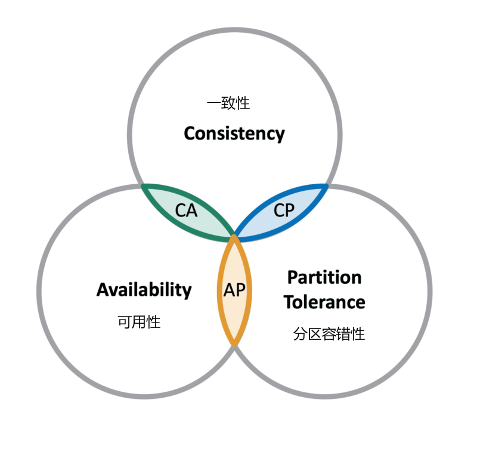

## Zookeeper

> ZooKeeper 是 Apache 软件基金会的一个软件项目，它为大型分布式计算提供开源的分布式配置服务、同步服务和命名注册。
>
> ZooKeeper 的架构通过冗余服务实现高可用性。
>
> Zookeeper 的设计目标是将那些复杂且容易出错的分布式一致性服务封装起来，构成一个高效可靠的原语集，并以一系列简单易用的接口提供给用户使用。
>
> 一个典型的分布式数据一致性的解决方案，分布式应用程序可以基于它实现诸如数据发布/订阅、负载均衡、命名服务、分布式协调/通知、集群管理、Master 选举、分布式锁和分布式队列等功能。

### 1. CAP 理论

> CAP 理论指出对于一个分布式计算系统来说，不可能同时满足以下三点

- **一致性**：在分布式环境中，一致性是指数据在多个副本之间是否能够保持一致的特性，等同于所有节点访问同一份最新的数据副本。在一致性的需求下，当一个系统在数据一致的状态下执行更新操作后，应该保证系统的数据仍然处于一致的状态。

- **可用性：**每次请求都能获取到正确的响应，但是不保证获取的数据为最新数据。

- **分区容错性：**分布式系统在遇到任何网络分区故障的时候，仍然需要能够保证对外提供满足一致性和可用性的服务，除非是整个网络环境都发生了故障。

> 一个分布式系统最多只能同时满足一致性（Consistency）、可用性（Availability）和分区容错性（Partition tolerance）这三项中的两项。
>
> 在这三个基本需求中，最多只能同时满足其中的两项，P 是必须的，因此只能在 CP 和 AP 中选择，zookeeper 保证的是 CP，对比 spring cloud 系统中的注册中心 eruka 实现的是 AP

### 2. BASE 理论

>  BASE 是 Basically Available(基本可用)、Soft-state(软状态) 和 Eventually Consistent(最终一致性) 三个短语的缩写。

- **基本可用：**在分布式系统出现故障，允许损失部分可用性（服务降级、页面降级）。
- **软状态：**允许分布式系统出现中间状态。而且中间状态不影响系统的可用性。这里的中间状态是指不同的 data replication（数据备份节点）之间的数据更新可以出现延时的最终一致性。
- **最终一致性：**data replications 经过一段时间达到一致性。

>  BASE 理论是对 CAP 中的一致性和可用性进行一个权衡的结果，理论的核心思想就是：我们无法做到强一致，但每个应用都可以根据自身的业务特点，采用适当的方式来使系统达到最终一致性

### 3. Zookeeper session 基本原理

> 客户端与服务端之间的连接是基于 TCP 长连接，client 端连接 server 端默认的 2181 端口，也就是 session 会话。
>
> 从第一次连接建立开始，客户端开始会话的生命周期，客户端向服务端的ping包请求，每个会话都可以设置一个超时时间。
>
> **sessionID**: 会话ID，用来唯一标识一个会话，每次客户端创建会话的时候，zookeeper 都会为其分配一个全局唯一的 sessionID

#### 3.1 Session 的状态

- **connecting**：连接中，session 一旦建立，状态就是 connecting 状态，时间很短。
- **connected**：已连接，连接成功之后的状态。
- **closed**：已关闭，发生在 session 过期，一般由于网络故障客户端重连失败，服务器宕机或者客户端主动断开。

> zookeeper 的 leader 服务器再运行期间定时进行会话超时检查，时间间隔是 ExpirationInterval，单位是毫秒，默认值是 tickTime，每隔 tickTime 进行一次会话超时检查。
>
> 在 zookeeper 运行过程中，客户端会在会话超时过期范围内向服务器发送请求（包括读和写）或者 ping 请求，俗称**心跳检测**完成会话激活，从而来保持会话的有效性。

### 4. Zookeeper 节点特性

> 1. 同一级节点 key 名称是唯一的
> 2. 创建节点时，必须要带上全路径
> 3. session关闭，临时结点清除
> 4. 自动创建顺序结点
> 5. watch机制，监听结点变化
> 6. delete命令只能一层一层删除

#### 4.1 zookeeper 常用场景

> 1. 数据发布/订阅
> 2. 负载均衡
> 3. 分布式协调/通知
> 4. 集群管理
> 5.  集群管理
> 6. master 管理
> 7.  分布式锁
> 8. 分布式队列
